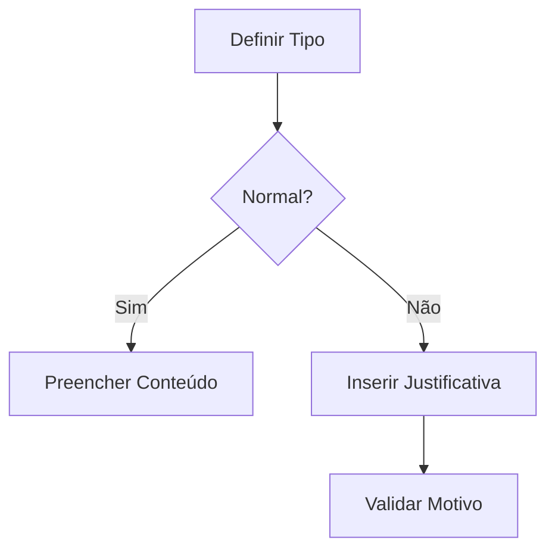
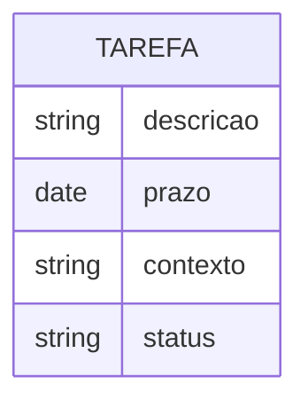
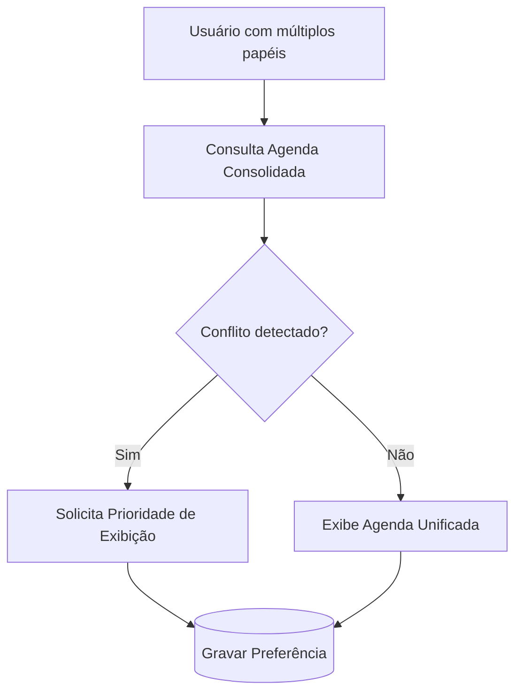

# 📘 Documento Unificado de Regras de Negócio – SGSA 

**Sistema:** SGSA – Sistema de Gerenciamento de Sala de Aula  
**Versão:** 6.4 (Unificação técnica + aprofundamento analítico)  
**Atualizado em:** 23/05/2025  

---

## 🎯 Visão Geral

- Regras de negócio atualizadas e priorizadas.
- Complementos analíticos (novas regras e fluxos).
- Modelos visuais explicativos e fluxos operacionais.
- Checklist de validação técnica e pedagógica.

As regras estão organizadas por módulo funcional e estão preparadas para suporte ao desenvolvimento técnico, testes e auditoria funcional.

---

## 🔐 1. Controle de Acesso e Perfis

| Código | Regra                              | Descrição                                                    |
| ------ | ---------------------------------- | ------------------------------------------------------------ |
| RN01   | Acesso hierárquico                 | Diretor > Coordenação > Professores > Secretaria, cada um com permissões específicas. |
| RN02   | Cadastro centralizado              | Todos os usuários são registrados via tabela única com tipo definido por perfil. |
| RN03   | Validação de credenciais           | Login via e-mail e senha criptografada.                      |
| RN21   | Multipapel de usuários             | Um usuário pode assumir múltiplos papéis simultaneamente (ex: professor e coordenador). |
| RN22   | Registro de acesso                 | Todo login é registrado com data, hora, IP e agente.         |
| RN31   | Autenticação em dois fatores (2FA) | Ativação de 2FA para perfis críticos (ex: administrador, coordenação). |
| RN32   | Auditoria de alterações            | Todas as ações de criação, edição ou exclusão são auditadas com: tipo de operação, usuário, data/hora, IP e, quando aplicável, valores anteriores. |
| RN39   | Gerenciamento de usuários e perfis | O administrador pode criar, editar, desativar usuários e atribuir/remover perfis. |
| RN41   | Acesso administrativo completo     | O administrador tem permissão irrestrita ao sistema e aos dados sensíveis. |
| RN42   | Configurações globais do sistema   | O administrador define parâmetros de segurança, acesso e operação sistêmica. |

------

## 🏫 2. Estrutura Acadêmica

| Código | Regra                   | Descrição                                                    |
| ------ | ----------------------- | ------------------------------------------------------------ |
| RN04   | Vinculação acadêmica    | Ciclos, séries e turmas estão relacionadas por ano letivo.   |
| RN05   | Composição de turma     | Cada turma é composta por alunos, professores e associada ao turno. |
| RN28   | Turno obrigatório       | Cada turma deve ter um turno definido (Matutino, Vespertino, Noturno). |
| RN33   | Histórico de turmas     | Mudanças de turma dos alunos são registradas com data de entrada e saída. |
| RN40   | Estrutura institucional | O administrador pode gerenciar ciclos, séries, turmas, horários e intervalos. |

------

## 🧑‍🏫 3. Registro de Aula

| Código | Regra                         | Descrição                                                    |
| ------ | ----------------------------- | ------------------------------------------------------------ |
| RN06   | Estrutura de aula             | Aulas possuem campos obrigatórios: conteúdo, capítulo, páginas, data, horário. |
| RN07   | Conteúdo obrigatório          | O campo de conteúdo da aula é obrigatório para seu registro. |
| RN08   | Janela de edição              | Aulas podem ser editadas por até 72 horas após registradas.  |
| RN23   | Aula não ministrada           | Aulas podem ser registradas como `cancelada`, exigindo campo de justificativa. Isto é diferente de `prevista`, que indica apenas agendamento. |
| RN34   | Planejamento de aulas futuras | Aulas podem ser cadastradas como `prevista`, `realizada` ou `cancelada`. |

------

## 🧾 4. Chamada e Frequência

| Código | Regra               | Descrição                                                    |
| ------ | ------------------- | ------------------------------------------------------------ |
| RN09   | Registro individual | Frequência é registrada por aluno, por aula.                 |
| RN10   | Consolidação diária | O sistema gera relatórios de frequência ao final de cada dia. |
| RN19   | Histórico de faltas | Consolidado por mensal, bimestre, trimestre, semestre, anual, série, aluno, com opção de visualização individual e por agrupamento institucional. |
| RN24   | Registro ampliado   | Marcação de presença suporta os estados: `presente`, `ausente`, `atrasado`, `saiu cedo`, `parcial`. |

------

## 📚 5. Tarefas e Atividades

| Código | Regra                  | Descrição                                                    |
| ------ | ---------------------- | ------------------------------------------------------------ |
| RN11   | Atribuição flexível    | Tarefas podem ser atribuídas por turma ou individualmente por aluno. |
| RN12   | Estrutura da tarefa    | Toda tarefa deve conter: descrição, capítulo, páginas, tipo, prazo. |
| RN13   | Notificação de prazo   | Alerta enviado ao aluno e/ou responsável 48h antes do vencimento. |
| RN25   | Atividade fora da aula | Tarefas podem ser cadastradas independentemente de uma aula. O sistema deve permitir indicar se a tarefa está vinculada ou não a uma aula. |
| RN35   | Status das tarefas     | As tarefas podem assumir os seguintes status: `pendente`, `entregue`, `atrasada`, `reentregue`, `avaliada`. |
| RN36   | Avaliação digital      | Tarefas podem ser avaliadas diretamente dentro do sistema por critérios definidos. |

------

## ⚠️ 6. Ocorrências

| Código | Regra                     | Descrição                                                    |
| ------ | ------------------------- | ------------------------------------------------------------ |
| RN14   | Classificação             | Tipos de ocorrência: Acadêmica, Comportamental, Saúde.       |
| RN15   | Registro detalhado        | Requer tipo, descrição, justificativa, data.                 |
| RN16   | Notificação               | Ocorrências graves geram alerta automático para a coordenação. |
| RN20   | Relatório de ocorrências  | Relatórios periódicos (mensal, bimestre, trimestre, semestre, anual). |
| RN26   | Nível de sigilo           | Ocorrências têm níveis de visibilidade: baixo, médio, alto.  |
| RN27   | Ocorrência fora da aula   | Podem ser registradas mesmo sem vínculo com uma aula. Deve haver campo "vinculada à aula?" para controle. |
| RN37   | Ocorrência por disciplina | Permite vincular a ocorrência a uma disciplina específica, sendo obrigatório quando houver relação com conteúdo didático. |

------

## 🕒 7. Horários e Agenda

| Código | Regra                       | Descrição                                                    |
| ------ | --------------------------- | ------------------------------------------------------------ |
| RN29   | Intervalos personalizados   | Cada série ou segmento possui horários próprios de intervalo. |
| RN30   | Grade horária por segmento  | Segmentos têm estrutura de horário distinta por turno.       |
| RN38   | Agenda integrada por perfil | Usuários veem sua agenda consolidada com base em seus perfis. Em caso de múltiplos papéis, prevalece a agenda de maior hierarquia. |

------

## 🛡️ 8. Auditoria (Nova Regra)

| Código | Regra                   | Descrição                                                    |
| ------ | ----------------------- | ------------------------------------------------------------ |
| RN43   | Auditoria de alterações | Toda ação sensível (criação, edição ou exclusão) em módulos do sistema é registrada com: tipo de operação, usuário, data/hora, IP, e dados anteriores. |

------

## ✅ Conclusão

Com esta atualização, o conjunto de Regras de Negócio está em total alinhamento com os Casos de Uso atualizados do SGSA. O sistema agora oferece cobertura total para rastreabilidade, integridade de registros, personalização pedagógica e segurança operacional.

Estas regras são a base para validação técnica e funcional nas etapas de implementação e testes.

---

## 🆕 9. Regras Complementares de Perfis Dinâmicos

| RN44   | Auditoria de alterações            | Todas as ações críticas do sistema devem ser registradas com data, usuário e contexto. |

| Código | Regra                           | Descrição                                                    |
| ------ | ------------------------------- | ------------------------------------------------------------ |
| RN45   | Troca de perfil em tempo real   | Usuários com múltiplos papéis podem alternar entre eles sem novo login. |
| RN46   | Validação de conflito de perfis | O sistema deve impedir ou alertar sobre combinações inválidas (ex: professor-aluno). |

---

## ✅ Checklist de Validação

1. [x] Todos os casos de uso referenciam as RNs correspondentes  
2. [x] Novos status e campos obrigatórios incorporados  
3. [x] Diagramas e templates incorporados  
4. [ ] Validação final com equipe pedagógica (pendente)  

---

## 📎 Apêndice – Modelos e Diagramas

### 🔄 Fluxo: Registro de Aula com Cancelamento



### 📚 Modelo de Tarefa Independente



### 📝 Template Markdown de Ocorrência

```markdown
## [TIPO] - [DISCIPLINA]  
**Data:** [DD/MM/AAAA HH:MM]  
**Gravidade:** [Baixa/Média/Alta]  
**Evidências Obrigatórias:** (Para níveis Médio/Alta)
```


### ⚖️ Fluxo – Resolução de Conflito de Agendas (RN46)


