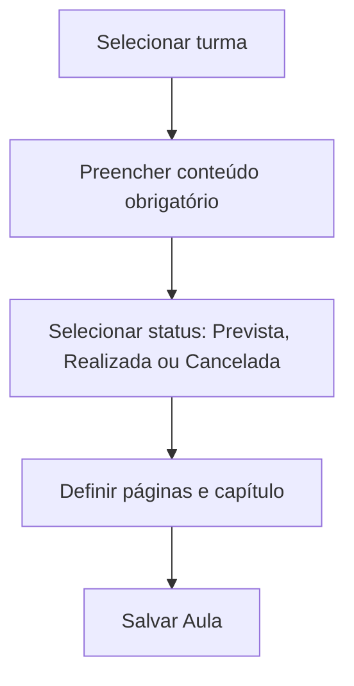
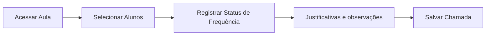
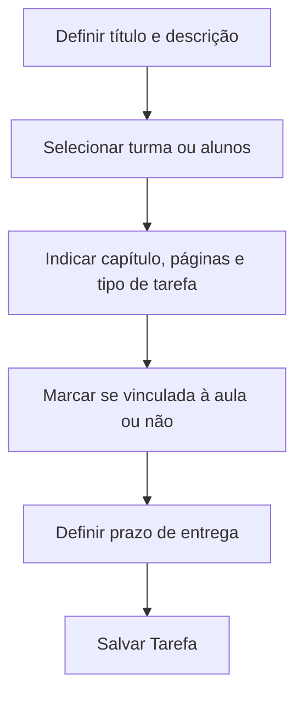
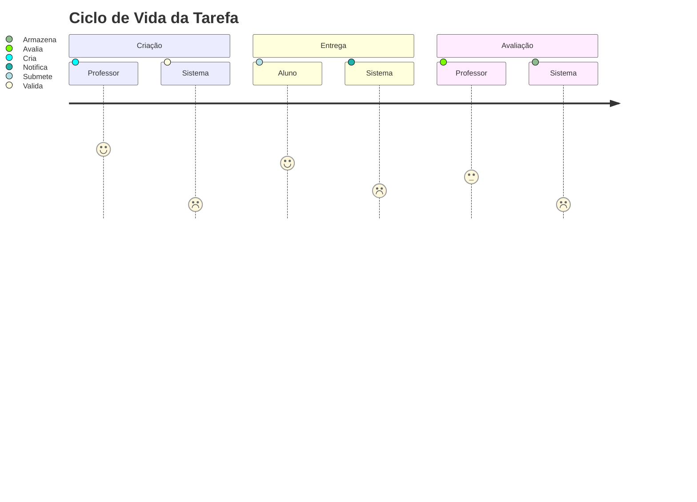
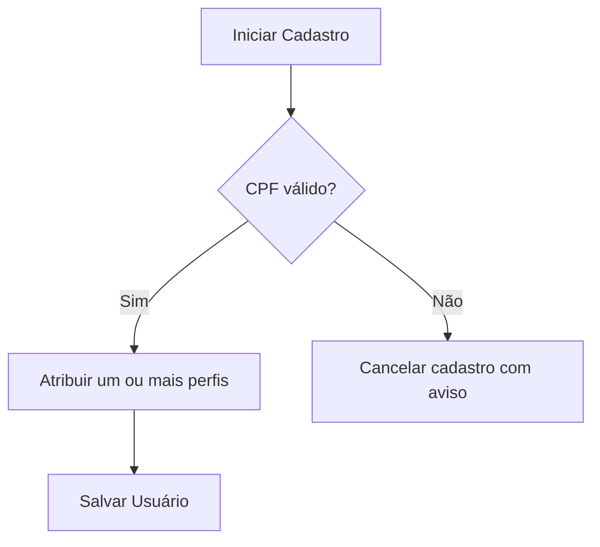
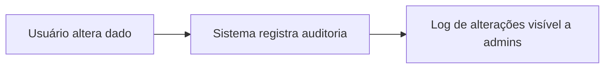
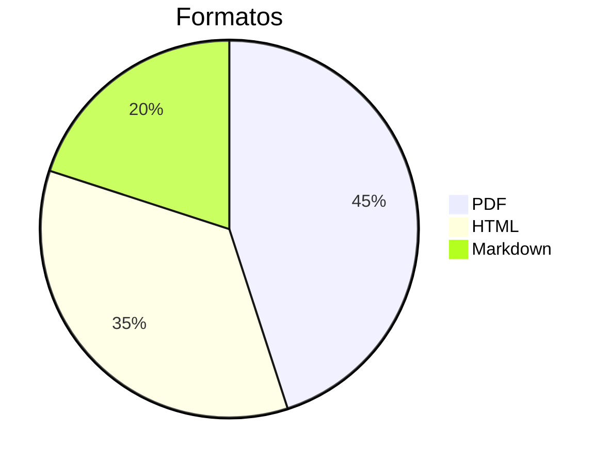

# 📘 SGSA – Documento Unificado de Casos de Uso e Regras de Negócio  
**Versão:** 6.1 | **Atualizado em:** 21/05/2025  

---

## 🔍 Sumário

1. [Visão Geral](#visão-geral)  
2. [Casos de Uso](#casos-de-uso)  
3. [Anexos](#anexos)  
4. [Checklist Final](#checklist-final)

---

## 🌐 Visão Geral

Este documento unifica as versões `chat_v5.3` (pragmática e funcional) e `deep_v6.0` (analítica e ampliada), consolidando:

- **Casos de uso validados com base nas RNs v6.0**
- **Diagramas de fluxo, ciclo de vida e templates padronizados**
- **Campos obrigatórios e validações técnicas e pedagógicas**
- **Rastreabilidade e padronização por perfis de usuário**

---

## 📂 Casos de Uso
---

## 10. Gerenciar Estrutura Institucional

**🎯 Ator Principal:** Administrador  
**📝 Descrição:** Permite criar e editar ciclos, séries e turmas vinculadas ao ano letivo, e definir a estrutura básica da instituição.

**✅ Pré-condições:** Acesso com permissão de administrador.  
**🔁 Fluxo Principal:**
1. Cria ou edita ciclos (ex: Fundamental I, Médio).
2. Define séries associadas aos ciclos.
3. Cria turmas vinculadas ao ano letivo e série.
4. Define turno da turma (matutino, vespertino, noturno).

**📦 Pós-condições:** Estrutura institucional refletida no sistema para uso por todos os perfis.

**🔗 Regras Relacionadas:** RN04, RN05, RN28, RN40


## 1. Registrar Aula

**Ator:** Professor
 **Regras Relacionadas:** RN06, RN07, RN08, RN23, RN34, RN32

**Pré-condições:**

- Autenticação válida
- Vínculo com turma ativa

**Fluxo Principal:**



**Campos e Validações:**

| Campo                 | Obrigatório? | Tipo     | Observações                           |
| --------------------- | ------------ | -------- | ------------------------------------- |
| Conteúdo              | ✅            | Texto    | Mín. 10 caracteres                    |
| Capítulo              | ✅            | Numérico | Inteiro positivo                      |
| Páginas               | ❌            | Texto    | Ex: "12-17"                           |
| Status                | ✅            | Dropdown | Prevista, Realizada, Cancelada        |
| Motivo (se cancelada) | ⚠️            | Texto    | Obrigatório quando status = Cancelada |

**Observações:**

- Aulas podem ser editadas por até 72h (RN08)
- Canceladas exigem justificativa obrigatória (RN23)
- Todas as alterações são auditadas (RN32)

------

---

## 2. Realizar Chamada

**Ator:** Professor
 **Regras Relacionadas:** RN09, RN10, RN19, RN24, RN08, RN32

**Fluxo Principal:**



**Estados de Presença:**

- ✅ Presente
- ❌ Ausente
- ⏳ Atrasado (>15min)
- ✂️ Saiu cedo
- 🔁 Presença parcial

**Interface Visual:**

```mockup
[ ] Presente  [ ] Ausente  [ ] Atrasado  [ ] Saiu cedo  [ ] Parcial
[Justificativa opcional para ausência/atraso]
[Botão: Salvar Chamada]
```

**Observações:**

- Registro individual por aluno por aula (RN09)
- Histórico é consolidado por bimestre (RN19)
- Chamada pode ser editada por 72h (RN08)
- Registros auditados (RN32)

------

---

## 3. Atribuir e Avaliar Tarefa

**Ator:** Professor
 **Regras Relacionadas:** RN11, RN12, RN13, RN25, RN35, RN36, RN32

**Fluxo Principal:**



**Estados de Tarefa:**

- 📌 Pendente
- ⏰ Atrasada
- 📥 Entregue
- 🔁 Reentregue
- ✅ Avaliada

**Diagrama de Ciclo de Vida:**



**Observações:**

- Tarefa pode ser desvinculada de uma aula (RN25)
- Alertas automáticos 48h antes do prazo (RN13)
- Todo o histórico é auditável (RN32)

------

---

## 4. Registrar Ocorrência

**Ator:** Professor, Coordenação, Secretaria
 **Regras Relacionadas:** RN14 a RN16, RN20, RN26, RN27, RN37, RN32

**Template:**

```markdown
## [TIPO DE OCORRÊNCIA]
**Data:** [DD/MM/AAAA]
**Turma/Aluno:** [Selecionar]
**Disciplina (se aplicável):** [Selecionar]
**Vinculada a Aula?** Sim/Não
**Descrição:** [Texto]
**Justificativa:** [Opcional]
**Anexos:** [Arquivos Upload]
```

**Notificações Automáticas:**

| Nível | Ação do Sistema         |
| ----- | ----------------------- |
| Leve  | E-mail ao responsável   |
| Médio | E-mail + App            |
| Grave | SMS + bloqueio da conta |

**Observações:**

- Disciplinas e vínculo com aula agora inclusos (RN37, RN27)
- Nível de sigilo configurável (RN26)
- Registros auditáveis (RN32)

------

---

## 5. Gerenciar Usuários e Perfis

**Ator:** Administrador, Coordenação
 **Regras Relacionadas:** RN01, RN02, RN21, RN39, RN41, RN42, RN32

**Fluxo:**



**Campos:**

- Nome completo
- E-mail
- CPF
- Perfis (vários): Professor, Coordenador, etc.

**Observações:**

- Usuários podem ter múltiplos perfis (RN21)
- Controle hierárquico de permissões (RN01)
- Registro de acessos e alterações é obrigatório (RN22, RN32)

------

---

## 6. Gerenciar Grade Horária

**Ator:** Coordenação, Administrador
 **Regras Relacionadas:** RN28, RN29, RN30, RN40, RN32

**Modelo JSON:**

```json
{
  "turno": "Matutino",
  "aulas": [
    { "ordem": 1, "inicio": "07:00", "fim": "07:50", "intervalo": false }
  ],
  "configuracoes": {
    "tolerancia_atraso": 15,
    "limite_ausencias": 25
  }
}
```

**Observações:**

- Intervalos e grades personalizáveis por série (RN29, RN30)
- Alterações auditadas (RN32)

------

---

## 7. Consultar Agenda

**Ator:** Todos os Perfis
 **Regras Relacionadas:** RN38, RN32

**Visões:**

- **Professor**: Aulas por turma, tarefas pendentes
- **Aluno**: Horários semanais, prazos de entrega
- **Coordenação/Admin**: Conflitos de agendamento, visão global

**Comportamento Especial:**

- Em caso de múltiplos perfis, sistema consolida agendas priorizando o mais alto na hierarquia (Admin > Coordenação > Professor > Aluno)

------

---

## 8. Auditoria de Alterações

**Aplicável a:** Todos os fluxos onde há edição ou exclusão de dados
 **Regras Relacionadas:** RN32

**Campos Auditáveis:**

- Tipo de operação: Criação, Edição, Exclusão
- Usuário responsável
- Data e hora
- IP de origem
- Dados anteriores (quando aplicável)

**Diagrama de Fluxo:**



------

## 📎 Anexos  

### Matriz de Rastreabilidade Completa  
[Link para planilha](#)  

### Códigos de Erro  
| Código | Descrição                |
| ------ | ------------------------ |
| 460    | Conflito de perfis       |
| 461    | Disciplina não informada |

### Versões para Exportação  


---

