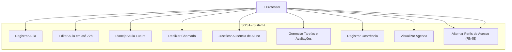
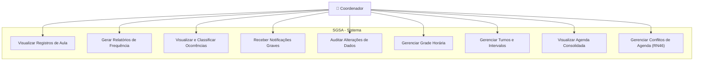
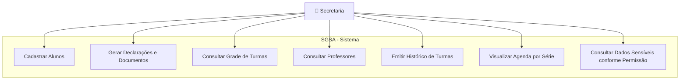

# 📊 Diagramas de Caso de Uso por Perfil – SGSA

A seguir estão os esboços dos **casos de uso** representando as funcionalidades principais de cada perfil do sistema SGSA.

------

## 👩‍🏫 Caso de Uso – Professor

------

## 👨‍💼 Caso de Uso – Coordenação

------

## 👩‍💼 Caso de Uso – Secretaria

------

## 🧑‍💻 Caso de Uso – Administrador

```mermaid
flowchart TB
    Administrador["👤 Administrador"]

    subgraph SGSA [SGSA - Sistema]
        D1["Cadastrar Usuários"]
        D2["Atribuir Perfis"]
        D3["Editar Permissões"]
        D4["Gerenciar Ciclos, Séries e Turmas"]
        D5["Configurar Grade Horária Global"]
        D6["Configurar Intervalos por Segmento"]
        D7["Auditar Logs do Sistema"]
        D8["Configurar Parâmetros do Sistema"]
        D9["Ativar 2FA Global"]
        D10["Gerenciar Estrutura Institucional (RN40)"]
        D11["Gerenciar Conflitos de Agenda (RN46)"]
        D12["Trocar de Perfil em Tempo Real (RN45)"]
    end

    Administrador --> D1
    Administrador --> D2
    Administrador --> D3
    Administrador --> D4
    Administrador --> D5
    Administrador --> D6
    Administrador --> D7
    Administrador --> D8
    Administrador --> D9
    Administrador --> D10
    Administrador --> D11
    Administrador --> D12
```

