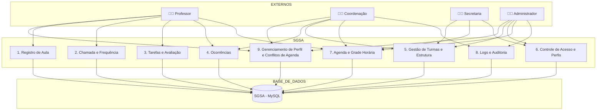

# 📊 SGSA – Diagrama de Fluxo de Dados (Funcional + ERD)  
**Versão:** 1.1  
**Atualizado em:** 21/05/2025  

---

## 🔍 Visão Geral

Este documento consolida os dois modelos complementares de fluxo de dados do SGSA:

- 📈 Um **DFD de nível 1 funcional**, com foco nos módulos e perfis de usuário.
- 🧩 Um **Diagrama Entidade-Relacionamento (ERD)** detalhado, com base na estrutura do banco de dados lógico do SGSA.

O objetivo é fornecer uma visão integrada da arquitetura do sistema, tanto do ponto de vista funcional quanto estrutural.

---

## 📈 DFD – Diagrama Funcional de Nível 1

# 📈 Diagrama de Fluxo de Dados (DFD) – SGSA – Nível 1

Abaixo está o Diagrama de Fluxo de Dados de nível 1 do sistema SGSA (Sistema de Gerenciamento de Sala de Aula), descrevendo os principais processos e como os dados fluem entre usuários, módulos e banco de dados.



------

## 📌 Legenda dos Módulos

| Código | Módulo                       | Descrição resumida                                       |
| ------ | ---------------------------- | -------------------------------------------------------- |
| A1     | Registro de Aula             | Registro de conteúdo, capítulo, status da aula           |
| A2     | Chamada e Frequência         | Presenças, atrasos, saídas, relatório diário e bimestral |
| A3     | Tarefas e Avaliação          | Criação, status e avaliação de tarefas                   |
| A4     | Ocorrências                  | Registro por tipo, sigilo, disciplina e notificação      |
| A5     | Gestão de Turmas e Estrutura | Séries, turmas, ciclos, intervalos e horários            |
| A6     | Controle de Acesso e Perfis  | Criação de usuários, atribuição de papéis                |
| A7     | Agenda e Grade Horária       | Consulta de horários por perfil e turno                  |
| A8     | Logs e Auditoria             | Registro de alterações e acessos (logs e 2FA)            |

---

## 🧩 DFD – Diagrama ER (Estrutura de Dados)

```mermaid
erDiagram
    USUARIO ||--o{ LOG_ACESSO : "registra"
    USUARIO ||--o{ USUARIO_PAPEL : "possui"
    USUARIO ||--o{ PROFESSOR : "é"
    USUARIO ||--o{ COORDENADOR : "é"
    USUARIO ||--o{ SECRETARIA : "é"
    USUARIO ||--o{ ADMINISTRADOR : "é"
    USUARIO ||--o{ ALUNO : "é"

    CICLO ||--o{ SERIE : "contém"
    SERIE ||--o{ TURMA : "classifica"
    ANO_LETIVO ||--o{ TURMA : "pertence"

    TURMA ||--o{ MATRICULA : "contém"
    TURMA ||--o{ TURMA_PROFESSOR : "aloca"
    TURMA ||--o{ AULA : "tem"

    AULA ||--o{ CHAMADA : "registra"
    AULA ||--o{ TAREFA : "gera"
    AULA ||--o{ OCORRENCIA : "registra"

    ALUNO ||--o{ CHAMADA : "faz parte"
    ALUNO ||--o{ TAREFA : "executa"
    ALUNO ||--o{ OCORRENCIA : "envolve"

    TURMA ||--o{ OCORRENCIA : "ocorre em"

    GRADE_HORARIA {
        int id PK
        enum turno "Matutino|Vespertino|Noturno"
        string segmento
        tinyint ordem_aula
        time hora_inicio
        time hora_fim
    }

    INTERVALO_ESCOLAR {
        int id PK
        enum turno "Matutino|Vespertino|Noturno"
        string segmento
        time hora_inicio
        time hora_fim
        text observacao
    }

    CICLO {
        int id PK
        string nome "Fundamental 1|Fundamental 2|Médio"
    }

    ANO_LETIVO {
        int id PK
        string ano "2025"
        date data_inicio
        date data_fim
    }

    SERIE {
        int id PK
        string nome "1º ano"
        int id_ciclo FK
    }

    USUARIO {
        int id PK
        string nome
        string email UK
        string senha_criptografada
        date data_nascimento
        string cpf UK
        string telefone
        string avatar_url
        datetime ultimo_login
        enum status "Ativo|Inativo"
        datetime criado_em
    }

    LOG_ACESSO {
        int id PK
        int id_usuario FK
        datetime data_hora
        string ip
        string user_agent
    }

    USUARIO_PAPEL {
        int id PK
        int id_usuario FK
        enum papel "Professor|Coordenador|Secretaria|Administrador"
    }

    PROFESSOR {
        int id_usuario FK, PK
        string formacao
        string disciplina_principal
        string curriculo_lattes
        enum regime "CLT|Estadual|Municipal"
    }

    COORDENADOR {
        int id_usuario FK, PK
        string cargo
        enum nivel_acesso "Diretor|Vice-Diretor|Coordenador Pedagógico|Coordenador Administrativo"
        string area_responsavel
        boolean acesso_dados_sensiveis
    }

    SECRETARIA {
        int id_usuario FK, PK
        enum setor "Matrículas|Financeiro|Documentos|Secretaria Acadêmica"
        boolean acesso_laudos_medicos
        boolean acesso_dados_financeiros
        string horario_expediente
    }

    ADMINISTRADOR {
        int id_usuario FK, PK
        boolean acesso_global
        boolean pode_gerenciar_estrutura
        boolean pode_gerenciar_usuarios
    }

    ALUNO {
        int id_usuario FK, PK
        string numero_matricula UK
        string alergias
        string medicamentos
        string nome_responsavel_2
        string telefone_responsavel_2
    }

    MATRICULA {
        int id PK
        int id_turma FK
        int id_aluno FK
        date data_inicio
        date data_fim
    }

    TURMA {
        int id PK
        string nome
        enum turno "Matutino|Vespertino|Noturno"
        int id_ano_letivo FK
        int id_serie FK
    }

    TURMA_PROFESSOR {
        int id PK
        int id_turma FK
        int id_professor FK
    }

    AULA {
        int id PK
        date data
        time horario "1º-7º"
        boolean foi_realizada
        string conteudo
        string capitulo
        string paginas
        int id_turma FK
        int id_professor FK
        enum status "Prevista|Realizada|Cancelada"
    }

    CHAMADA {
        int id PK
        enum status "Presente|Ausente|Atrasado|Saiu Cedo|Parcial"
        string justificativa
        int id_aluno FK
        int id_aula FK
    }

    TAREFA {
        int id PK
        string descricao
        string capitulo
        string paginas
        date prazo
        enum tipo "Individual|Turma"
        enum status "Pendente|Entregue|Atrasada|Reentregue"
        int id_aula FK "nullable"
        int id_turma FK "nullable"
        int id_aluno FK "nullable"
    }

    OCORRENCIA {
        int id PK
        enum tipo "Acadêmica|Comportamental|Saúde"
        enum sigilo "Baixo|Médio|Alto"
        string descricao
        string justificativa
        date data
        string disciplina "nullable"
        int id_aula FK "nullable"
        int id_turma FK "nullable"
        int id_aluno FK "nullable"
    }
```




✅ O **DFD – Diagrama de Fluxo de Dados (Nível 1)** do SGSA foi criado e documentado com:

- 📦 8 módulos principais.
- 🧑‍💻 Fluxo de interação com os quatro perfis: Professor, Coordenação, Secretaria e Administrador.
- 🔄 Integração direta com a base de dados SGSA (MySQL).


### 🧠 Tabela `preferencia_agenda`
```sql
CREATE TABLE preferencia_agenda (
  id INT PRIMARY KEY AUTO_INCREMENT,
  usuario_id INT NOT NULL,
  prioridade ENUM('Professor','Coordenador','Secretaria','Administrador') NOT NULL,
  data_definicao DATETIME DEFAULT CURRENT_TIMESTAMP,
  FOREIGN KEY (usuario_id) REFERENCES usuario(id)
);
-- RN46
```
