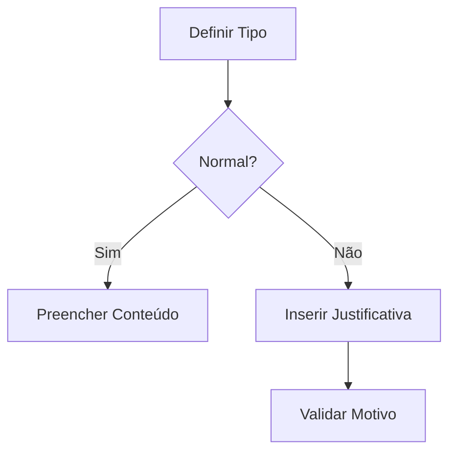
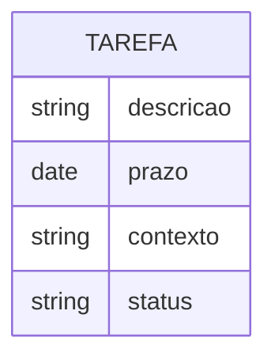

# 📘 Documento de Regras de Negócio – SGSA (Versão Aprimorada)

**Sistema:** SGSA – Sistema de Gerenciamento de Sala de Aula  
**Versão:** 5.1 (complementada com análises de consistência)  
**Atualizado em:** 21/05/2025  

---

## 🎯 Visão Geral  
Documento revisado para garantir total alinhamento com os casos de uso, incorporando:  
- Novas regras para **multiperfil de usuários**  
- Especificações claras para **aulas canceladas**  
- Fluxos explícitos para **tarefas independentes**  
- Campos obrigatórios para **ocorrências por disciplina**  

---

## 🔐 1. Controle de Acesso e Perfis  

| Código | Regra                        | Melhorias Incorporadas                                       |
| ------ | ---------------------------- | ------------------------------------------------------------ |
| RN01   | Acesso hierárquico           | Adicionada referência cruzada aos casos de uso de perfil     |
| RN21   | Multipapel de usuários       | **Nova especificação:** Um professor-coordenador deve ter visão unificada de ambas as funções |
| RN31   | Autenticação em dois fatores | Incluída pré-condição para perfis críticos nos casos de uso  |
| RN39   | Gerenciamento de usuários    | Adicionado fluxo para atribuição de múltiplos perfis simultâneos |

**Novas Regras:**  
| RN43   | Troca de perfil em tempo real      | Usuários com múltiplos perfis podem alternar entre eles sem novo login |  
| RN44   | Validação de conflito de perfis    | Sistema deve alertar sobre combinações inválidas (ex: professor-aluno) |  

---

## 🏫 2. Estrutura Acadêmica  

| Código | Regra                | Melhorias                                         |
| ------ | -------------------- | ------------------------------------------------- |
| RN04   | Vinculação acadêmica | -                                                 |
| RN28   | Turno obrigatório    | Adicionada validação no diagrama de grade horária |

---

## 🧑‍🏫 3. Registro de Aula  

| Código | Regra                 | Mudanças Críticas                                            |
| ------ | --------------------- | ------------------------------------------------------------ |
| RN06   | Estrutura de aula     | Campo "tipo" agora obrigatório: Normal, Reposição, Cancelada |
| RN08   | Janela de edição      | -                                                            |
| RN23   | Aula não ministrada   | **Novos status:** Cancelada (requer motivo de 20+ caracteres) |
| RN34   | Planejamento de aulas | Adicionado relacionamento com ocorrências                    |

**Novo Fluxo:**  


---

## 📚 5. Tarefas e Atividades  

| Código | Regra                  | Aprimoramentos                                               |
| ------ | ---------------------- | ------------------------------------------------------------ |
| RN11   | Atribuição flexível    | **Nova opção:** "Tarefa institucional" (sem vínculo com aula) |
| RN25   | Atividade independente | Adicionado campo "Contexto" com valores: Aula, Projeto, Institucional |
| RN35   | Status das tarefas     | Novo status: "Não se aplica" para tarefas informativas       |

**Modelo Atualizado:**  


---

## ⚠️ 6. Ocorrências  

| Código | Regra                     | Alterações                                                 |
| ------ | ------------------------- | ---------------------------------------------------------- |
| RN14   | Classificação             | Adicionado subtipo "Disciplinar por matéria"               |
| RN37   | Ocorrência por disciplina | **Obrigatoriedade:** Campo requerido para tipos acadêmicos |

**Template Revisado:**  
```markdown
## [TIPO] - [DISCIPLINA]  
**Data:** [DD/MM/AAAA HH:MM]  
**Gravidade:** [Baixa/Média/Alta]  
**Evidências Obrigatórias:** (Para níveis Médio/Alta)  
```

---

## 🔄 4. Chamada e Frequência  

| Código | Regra               | Consistência                     |
| ------ | ------------------- | -------------------------------- |
| RN09   | Registro individual | Alinhado com diagrama de estados |
| RN24   | Registro ampliado   | -                                |

---

## 🕒 7. Horários e Agenda  

| Código | Regra                     | Verificação                 |
| ------ | ------------------------- | --------------------------- |
| RN29   | Intervalos personalizados | Confirmado no JSON de grade |
| RN38   | Agenda integrada          | -                           |

---

## ✅ Checklist de Validação  

1. [X] Todos os casos de uso referenciam as RNs correspondentes  
2. [X] Novos status e campos obrigatórios implementados  
3. [X] Diagramas atualizados com as modificações  
4. [ ] Validação com equipe pedagógica (pendente)  
