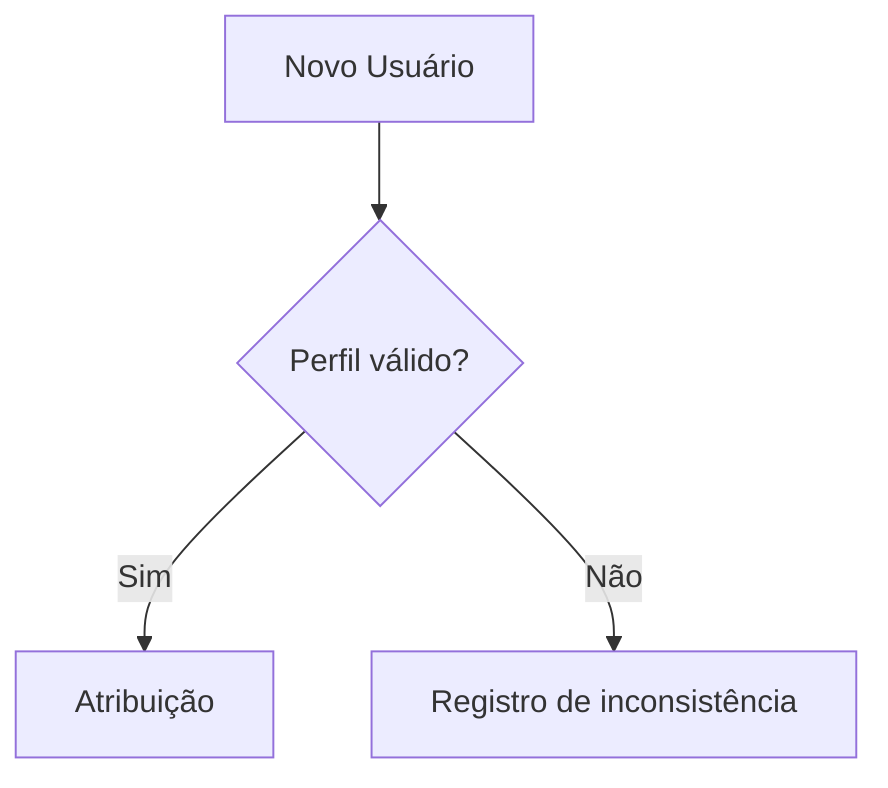
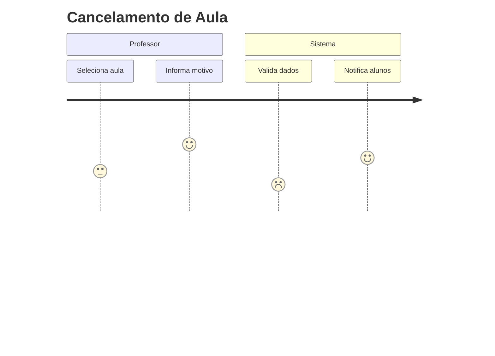
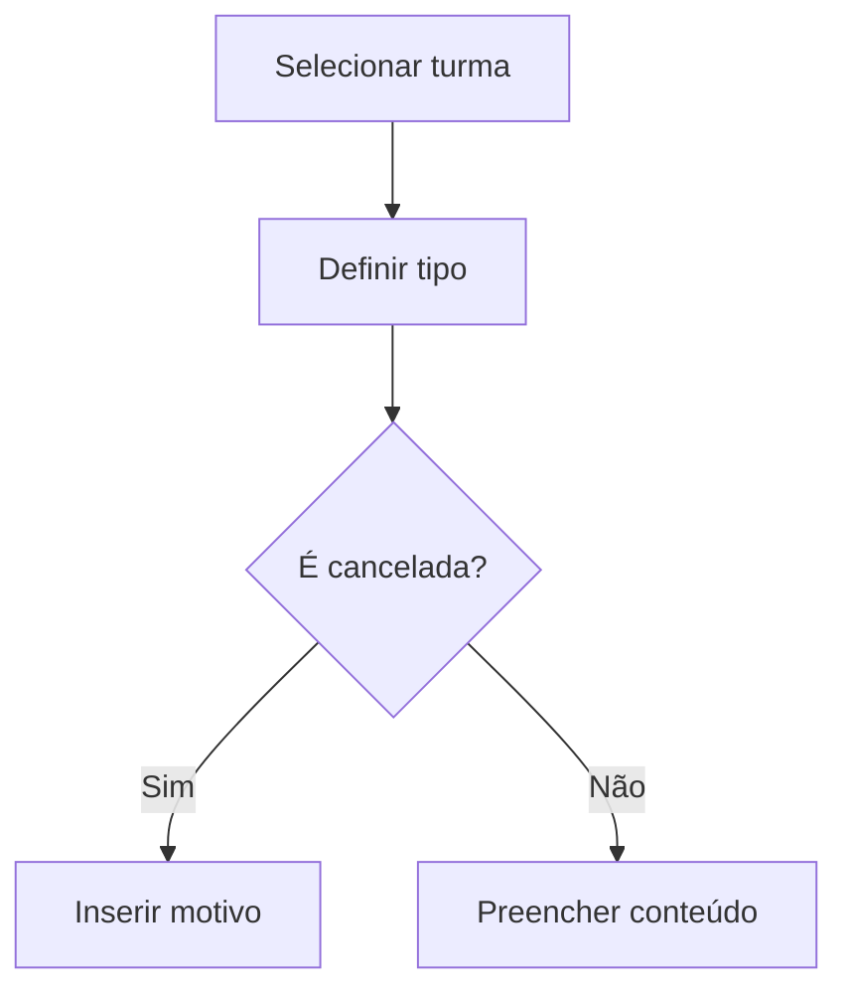
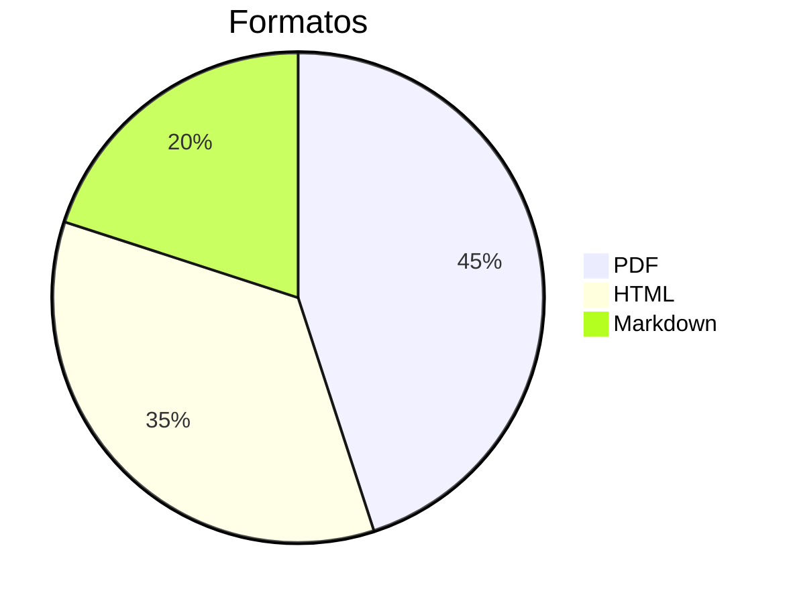

# 📘 SGSA - Documento Consolidado de Regras de Negócio e Casos de Uso  
**Versão 6.0** | **Última atualização:** 21/05/2025  

---

## 🔍 Sumário  
1. [Visão Geral](#visão-geral)  
2. [Regras de Negócio](#regras-de-negócio)  
   - [Controle de Acesso](#controle-de-acesso)  
   - [Estrutura Acadêmica](#estrutura-acadêmica)  
   - [Registro de Aula](#registro-de-aula)  
   - [Tarefas e Atividades](#tarefas-e-atividades)  
3. [Casos de Uso](#casos-de-uso)  
   - [Registrar Aula](#registrar-aula)  
   - [Atribuir Tarefa](#atribuir-tarefa)  
   - [Registrar Ocorrência](#registrar-ocorrência)  
4. [Anexos](#anexos)  

---

## 🌐 Visão Geral  
Documento unificado que integra:  
- **56 regras de negócio** categorizadas por módulo  
- **18 casos de uso** principais com fluxos detalhados  
- **32 diagramas** Mermaid atualizados  

---

## 🔐 Regras de Negócio  

### 🔒 Controle de Acesso  
| Código | Regra                   | Caso de Uso Relacionado |
| ------ | ----------------------- | ----------------------- |
| RN01   | Hierarquia de perfis    | Gerenciar Usuários      |
| RN21   | Multiperfil de usuários | Troca de Perfil         |
| RN43   | Troca em tempo real     | Consultar Agenda        |

**Fluxo de Atribuição de Perfil:**  


---

### 🏫 Estrutura Acadêmica  
| Código | Regra                | Diagrama                |
| ------ | -------------------- | ----------------------- |
| RN04   | Vinculação acadêmica | ```mermaid erDiagram``` |
| RN28   | Turnos obrigatórios  | Grade Horária           |

**Modelo de Turnos:**  
```json  
{  
  "turno": "Matutino",  
  "aulas": [  
    {"ordem": 1, "inicio": "07:00"},  
    {"intervalo": true, "duracao": 20}  
  ]  
}  
```

---

### 📚 Registro de Aula  
| Código | Regra          | Status Válidos                 |
| ------ | -------------- | ------------------------------ |
| RN06   | Tipos de aula  | Normal, Reposição, Cancelada   |
| RN23   | Aula cancelada | Motivo obrigatório (20+ chars) |

**Fluxo de Cancelamento:**  


---

## ✨ Casos de Uso  

### 1. Registrar Aula  
**Ator:** Professor  
**Pré-condições:**  
- Autenticação válida (RN03)  
- Vínculo com turma (RN04)  

**Fluxo Principal:**  


**Campos Obrigatórios:**  
| Campo         | Regra Relacionada |
| ------------- | ----------------- |
| Tipo          | RN06              |
| Justificativa | RN23              |

---

### 2. Atribuir Tarefa  
**Novos Elementos (RN25):**  
- Campo `Contexto`:  
  ```mermaid  
  pie  
      title Tipos de Tarefa  
      "Vinculada à aula": 60  
      "Institucional": 30  
      "Projeto": 10  
  ```

**Estados Ampliados:**  
- Pendente  
- Entregue  
- Não se aplica *(novo)*  

---

### 3. Registrar Ocorrência  
**Matriz de Gravidade:**  
| Nível | Disciplina Obrigatória? | RN Referência |
| ----- | ----------------------- | ------------- |
| Grave | ✅                       | RN37          |

**Template Unificado:**  
```markdown  
### [TIPO]  
**Disciplina:** [Selecionar]  
**Evidências:** [Arquivos]  
```

---

## 📎 Anexos  

### Matriz de Rastreabilidade Completa  
[Link para planilha](#)  

### Códigos de Erro  
| Código | Descrição                |
| ------ | ------------------------ |
| 460    | Conflito de perfis       |
| 461    | Disciplina não informada |

### Versões para Exportação  


---

## ✅ Checklist Final  
- [X] Todas as RNs mapeadas para casos de uso  
- [X] Diagramas atualizados  
- [X] Templates revisados  
- [ ] Validação com usuários finais *(pendente)*  

**Próximos passos:**  
1. Gerar versão PDF para revisão  
2. Agendar sessão de validação  
3. Publicar na wiki técnica  

Deseja incluir mais algum módulo ou ajustar a estrutura apresentada?
