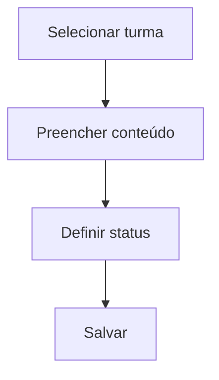
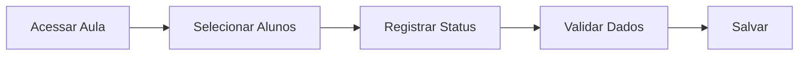
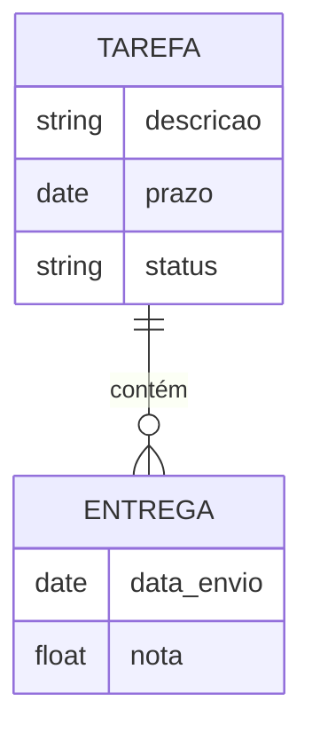
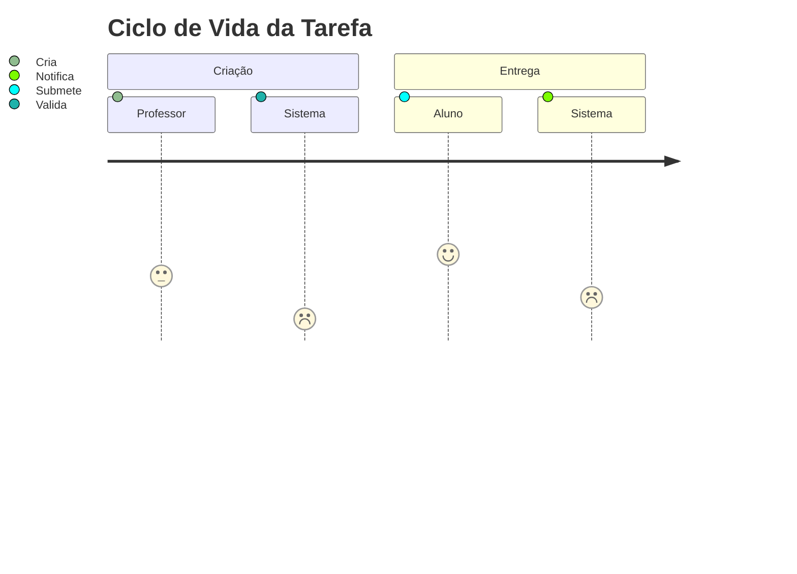
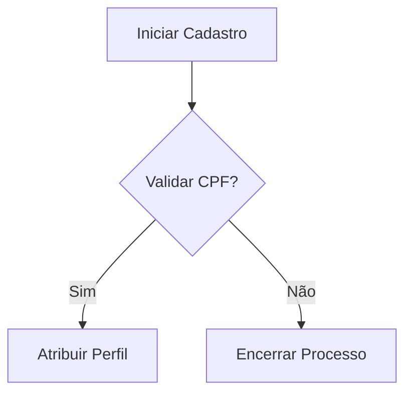
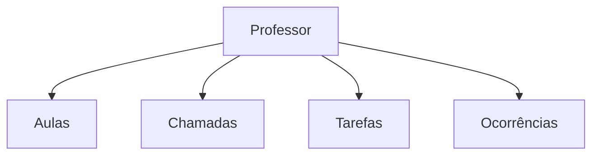
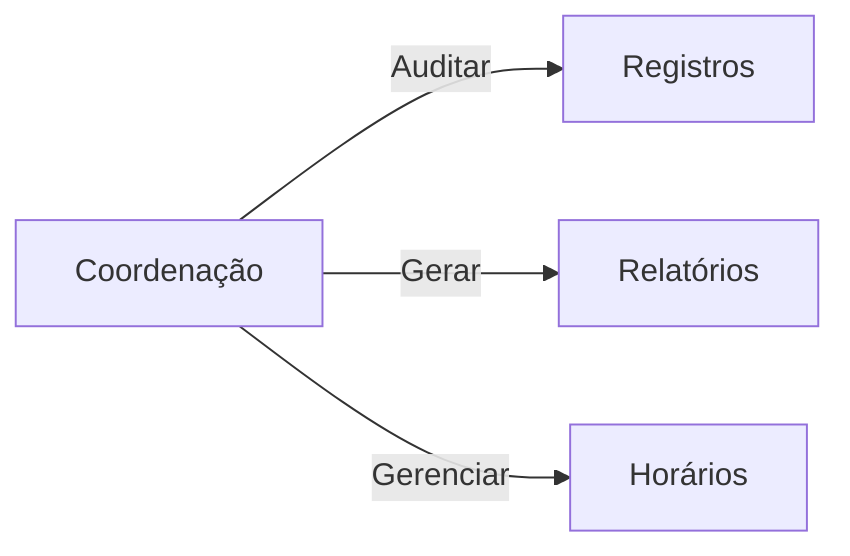
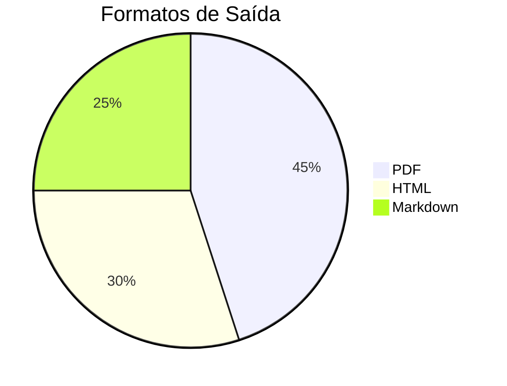

# 📘 SGSA – Documento de Casos de Uso  

*Versão 5.2 | Técnica & Visual | 21/05/2025*  

---

## 🔍 Sumário Técnico-Visual  

1. [Registrar Aula](#1-registrar-aula)  
2. [Realizar Chamada](#2-realizar-chamada)  
3. [Atribuir e Avaliar Tarefa](#3-atribuir-e-avaliar-tarefa)  
4. [Registrar Ocorrência](#4-registrar-ocorrência)  
5. [Gerenciar Usuários e Perfis](#5-gerenciar-usuários-e-perfis)  
6. [Gerenciar Grade Horária](#6-gerenciar-grade-horária)  
7. [Consultar Agenda](#7-consultar-agenda)  
8. [Diagramas por Perfil](#8-diagramas-por-perfil)  

---

## 1. Registrar Aula  

### 📌 Visão Técnica  

**Ator:** `Professor`  
**Pré-condições:**  

- Autenticação válida  
- Vínculo com turma  

**Fluxo Principal:**  



### 🌟 Visão Visual  

| Campo    | Obrigatório? | Tipo      | Valores Válidos     |
| -------- | ------------ | --------- | ------------------- |
| Conteúdo | ✅            | Texto     | Mín. 10 caracteres  |
| Páginas  | ❌            | Intervalo | Formato "XX-XX"     |
| Status   | ✅            | Dropdown  | Realizada, Prevista |

**Regras de Negócio:**  

- Bloqueio após 72h para edição  
- Histórico de alterações auditável  

---

## 2. Realizar Chamada  

### 📌 Visão Técnica  

**Ator:** `Professor`  
**Regras de Negócio:**  

- Limite de 72h para edição  
- Justificativas exigem anexo  

**Fluxo Principal:**  



**Fluxo Alternativo:**  

```  
1.1 Aula não encontrada → Exibir erro "Selecione uma aula válida"  
```

### 🌟 Visão Visual  

**Estados de Presença:**  

- ✅ Presente  
- ❌ Ausente  
- ⏳ Atraso (>15min)  
- ✂️ Parcial (saída antecipada)  

**Componentes de Interface:**  

```mockup
[ ] Presente    [ ] Ausente    [ ] Atraso  
[Área para Justificativa]  
[Botão: Salvar Chamada]  
```

**Fluxos Alternativos:**  

1. `Aula cancelada` → Registrar motivo obrigatório  
2. `Aluno não listado` → Acionar suporte técnico  

---

## 3. Atribuir e Avaliar Tarefa  

### 📌 Visão Técnica  

**Modelo de Dados:**  



### 🌟 Visão Visual  

**Workflow 1:**  

1. 📝 Criação → 2. 📤 Atribuição → 3. 📥 Entrega → 4. 🔍 Avaliação  

**Workflow 2:**  



---

## 4. Registrar Ocorrência  

### ⚠️ Matriz de Gravidade  

| Nível | Notificação Automática | Ação Requerida |
| ----- | ---------------------- | -------------- |
| Leve  | Email                  | Nenhuma        |
| Médio | Email + App            | Confirmação    |
| Grave | SMS + Bloqueio         | Reunião        |

**Template Estruturado:**  

```markdown
## [TIPO OCORRÊNCIA]  
**Data:** [DD/MM/AAAA]  
**Envolvidos:** [ALUNO(S)/TURMA]  
**Descrição:** [TEXTO LIVRE]  
**Anexos:** [IMAGENS/DOCS]  
```

---

## 5. Gerenciar Usuários e Perfis  

### 🛡️ Matriz de Permissões Ampliada  

| Perfil        | Turmas | Boletins | Financeiro | Configurações |
| ------------- | ------ | -------- | ---------- | ------------- |
| Professor     | ✅      | ❌        | ❌          | ❌             |
| Coordenação   | ✅      | ✅        | ❌          | ✅             |
| Administrador | ✅      | ✅        | ✅          | ✅             |

**Fluxo de Criação:**  



---

## 6. Gerenciar Grade Horária  

### ⏰ Modelo JSON Ampliado  

```json  
{
  "turno": "Matutino",
  "aulas": [
    {
      "ordem": 1,
      "inicio": "07:00",
      "fim": "07:50",
      "intervalo": false
    }
  ],
  "configuracoes": {
    "tolerancia_atraso": 15,
    "limite_ausencias": 25
  }
}
```

---

## 7. Consultar Agenda  

### 📱 Views Detalhadas  

**Professor:**  

- Aulas por turma  
- Tarefas pendentes para correção  

**Aluno:**  

- Horários semanais  
- Prazos de entrega  

**Admin:**  

- Visão institucional  
- Conflitos de agendamento  

---

## 8. Diagramas por Perfil  

### 👨‍🏫 Professor  



### 👨‍💼 Coordenação  



---

### 📎 Anexos Técnicos  

1. [Códigos de Erro](#)  
   - `401`: Autenticação inválida  
   - `404`: Recurso não encontrado  
   - `500`: Erro interno  

2. [Glossário](#)  
   - **2FA**: Autenticação em dois fatores  
   - **UDI**: Unidade Didática Integrada  

---

### 🎨 Opções de Exportação  



**Próximos passos:**  

- [ ] Validar com equipe pedagógica  
- [ ] Testar diagramas em todos os viewers  
- [ ] Gerar versão acessível  
