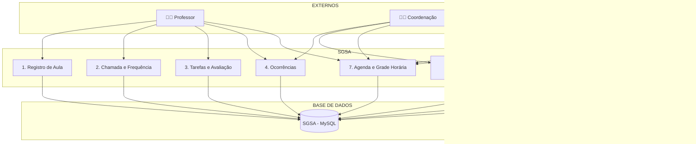

# 📈 Diagrama de Fluxo de Dados (DFD) – SGSA – Nível 1

Abaixo está o Diagrama de Fluxo de Dados de nível 1 do sistema SGSA (Sistema de Gerenciamento de Sala de Aula), descrevendo os principais processos e como os dados fluem entre usuários, módulos e banco de dados.

------

## 📌 Legenda dos Módulos

| Código | Módulo                       | Descrição resumida                                       |
| ------ | ---------------------------- | -------------------------------------------------------- |
| A1     | Registro de Aula             | Registro de conteúdo, capítulo, status da aula           |
| A2     | Chamada e Frequência         | Presenças, atrasos, saídas, relatório diário e bimestral |
| A3     | Tarefas e Avaliação          | Criação, status e avaliação de tarefas                   |
| A4     | Ocorrências                  | Registro por tipo, sigilo, disciplina e notificação      |
| A5     | Gestão de Turmas e Estrutura | Séries, turmas, ciclos, intervalos e horários            |
| A6     | Controle de Acesso e Perfis  | Criação de usuários, atribuição de papéis                |
| A7     | Agenda e Grade Horária       | Consulta de horários por perfil e turno                  |
| A8     | Logs e Auditoria             | Registro de alterações e acessos (logs e 2FA)            |
