```mermaid
erDiagram
    USUARIO ||--o{ LOG_ACESSO : "registra"
    USUARIO ||--o{ USUARIO_PAPEL : "possui"
    USUARIO ||--o{ PROFESSOR : "é"
    USUARIO ||--o{ COORDENADOR : "é"
    USUARIO ||--o{ SECRETARIA : "é"
    USUARIO ||--o{ ADMINISTRADOR : "é"
    USUARIO ||--o{ ALUNO : "é"

    CICLO ||--o{ SERIE : "contém"
    SERIE ||--o{ TURMA : "classifica"
    ANO_LETIVO ||--o{ TURMA : "pertence"

    TURMA ||--o{ MATRICULA : "contém"
    TURMA ||--o{ TURMA_PROFESSOR : "aloca"
    TURMA ||--o{ AULA : "tem"

    AULA ||--o{ CHAMADA : "registra"
    AULA ||--o{ TAREFA : "gera"
    AULA ||--o{ OCORRENCIA : "registra"

    ALUNO ||--o{ CHAMADA : "faz parte"
    ALUNO ||--o{ TAREFA : "executa"
    ALUNO ||--o{ OCORRENCIA : "envolve"

    TURMA ||--o{ OCORRENCIA : "ocorre em"

    GRADE_HORARIA {
        int id PK
        enum turno "Matutino|Vespertino|Noturno"
        string segmento
        tinyint ordem_aula
        time hora_inicio
        time hora_fim
    }

    INTERVALO_ESCOLAR {
        int id PK
        enum turno "Matutino|Vespertino|Noturno"
        string segmento
        time hora_inicio
        time hora_fim
        text observacao
    }

    CICLO {
        int id PK
        string nome "Fundamental 1|Fundamental 2|Médio"
    }

    ANO_LETIVO {
        int id PK
        string ano "2025"
        date data_inicio
        date data_fim
    }

    SERIE {
        int id PK
        string nome "1º ano"
        int id_ciclo FK
    }

    USUARIO {
        int id PK
        string nome
        string email UK
        string senha_criptografada
        date data_nascimento
        string cpf UK
        string telefone
        string avatar_url
        datetime ultimo_login
        enum status "Ativo|Inativo"
        datetime criado_em
    }

    LOG_ACESSO {
        int id PK
        int id_usuario FK
        datetime data_hora
        string ip
        string user_agent
    }

    USUARIO_PAPEL {
        int id PK
        int id_usuario FK
        enum papel "Professor|Coordenador|Secretaria|Administrador"
    }

    PROFESSOR {
        int id_usuario FK, PK
        string formacao
        string disciplina_principal
        string curriculo_lattes
        enum regime "CLT|Estadual|Municipal"
    }

    COORDENADOR {
        int id_usuario FK, PK
        string cargo
        enum nivel_acesso "Diretor|Vice-Diretor|Coordenador Pedagógico|Coordenador Administrativo"
        string area_responsavel
        boolean acesso_dados_sensiveis
    }

    SECRETARIA {
        int id_usuario FK, PK
        enum setor "Matrículas|Financeiro|Documentos|Secretaria Acadêmica"
        boolean acesso_laudos_medicos
        boolean acesso_dados_financeiros
        string horario_expediente
    }

    ADMINISTRADOR {
        int id_usuario FK, PK
        boolean acesso_global
        boolean pode_gerenciar_estrutura
        boolean pode_gerenciar_usuarios
    }

    ALUNO {
        int id_usuario FK, PK
        string numero_matricula UK
        string alergias
        string medicamentos
        string nome_responsavel_2
        string telefone_responsavel_2
    }

    MATRICULA {
        int id PK
        int id_turma FK
        int id_aluno FK
        date data_inicio
        date data_fim
    }

    TURMA {
        int id PK
        string nome
        enum turno "Matutino|Vespertino|Noturno"
        int id_ano_letivo FK
        int id_serie FK
    }

    TURMA_PROFESSOR {
        int id PK
        int id_turma FK
        int id_professor FK
    }

    AULA {
        int id PK
        date data
        time horario "1º-7º"
        boolean foi_realizada
        string conteudo
        string capitulo
        string paginas
        int id_turma FK
        int id_professor FK
        enum status "Prevista|Realizada|Cancelada"
    }

    CHAMADA {
        int id PK
        enum status "Presente|Ausente|Atrasado|Saiu Cedo|Parcial"
        string justificativa
        int id_aluno FK
        int id_aula FK
    }

    TAREFA {
        int id PK
        string descricao
        string capitulo
        string paginas
        date prazo
        enum tipo "Individual|Turma"
        enum status "Pendente|Entregue|Atrasada|Reentregue"
        int id_aula FK "nullable"
        int id_turma FK "nullable"
        int id_aluno FK "nullable"
    }

    OCORRENCIA {
        int id PK
        enum tipo "Acadêmica|Comportamental|Saúde"
        enum sigilo "Baixo|Médio|Alto"
        string descricao
        string justificativa
        date data
        string disciplina "nullable"
        int id_aula FK "nullable"
        int id_turma FK "nullable"
        int id_aluno FK "nullable"
    }
```

✅ O **DFD – Diagrama de Fluxo de Dados (Nível 1)** do SGSA foi criado e documentado com:

- 📦 8 módulos principais.
- 🧑‍💻 Fluxo de interação com os quatro perfis: Professor, Coordenação, Secretaria e Administrador.
- 🔄 Integração direta com a base de dados SGSA (MySQL).
