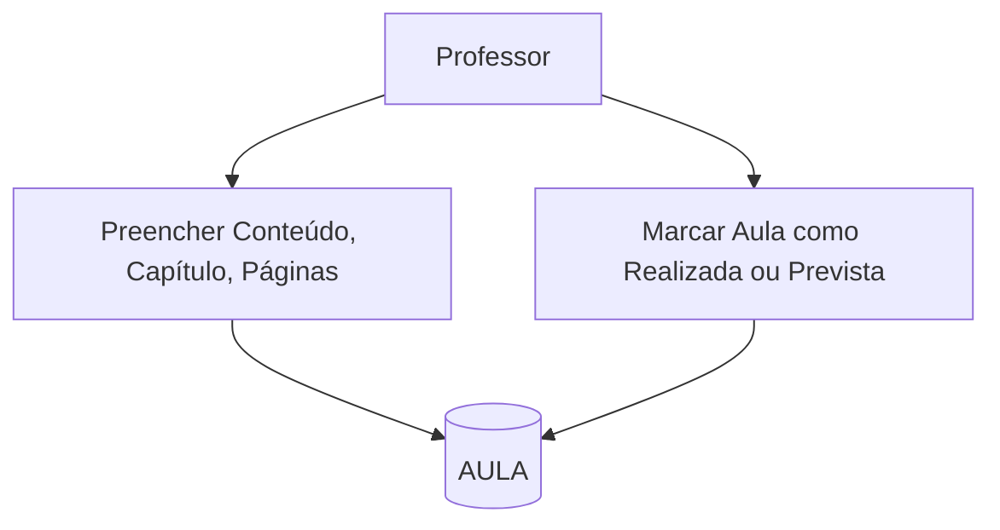
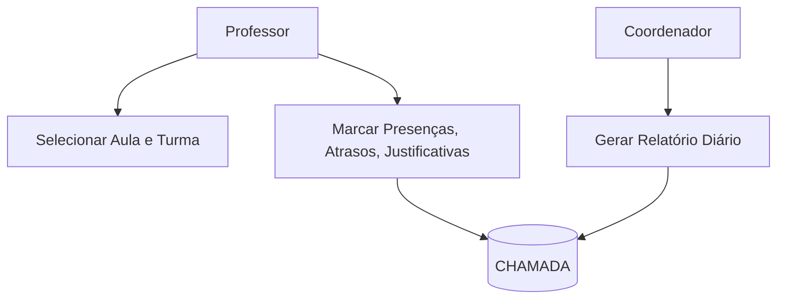
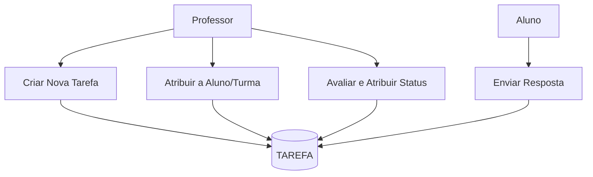
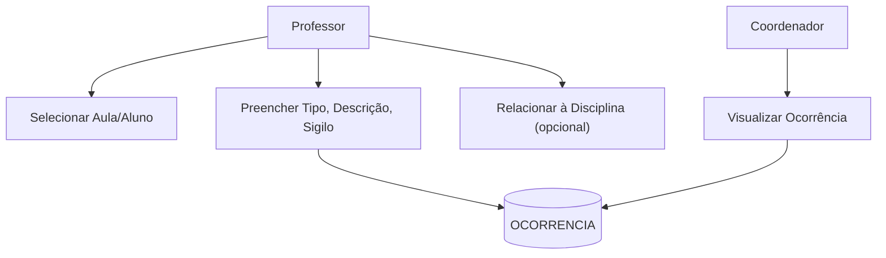
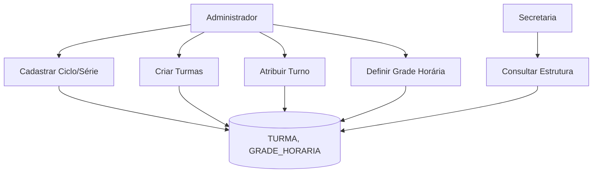
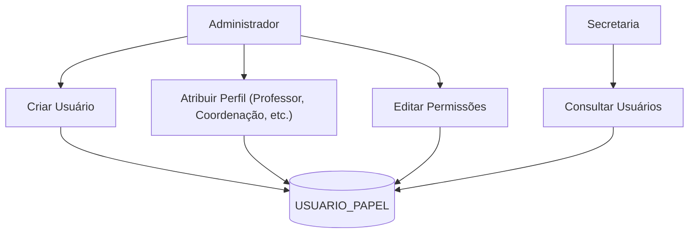
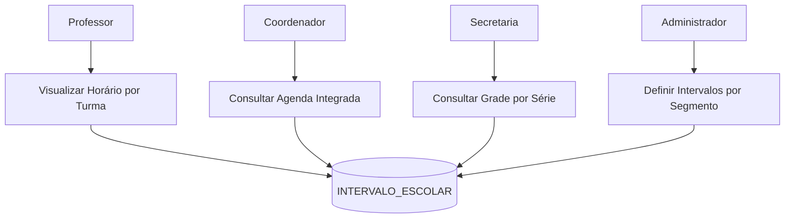
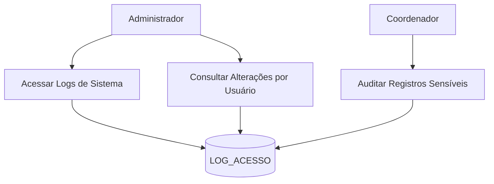

# 📈 Diagrama de Fluxo de Dados (DFD) – SGSA – Nível 2 por Módulo

Este documento apresenta os DFDs de Nível 2 detalhados para cada um dos 8 módulos principais do SGSA.

------

## 📘 Módulo A1 – Registro de Aula

------

## 📘 Módulo A2 – Chamada e Frequência

------

## 📘 Módulo A3 – Tarefas e Avaliação

------

## 📘 Módulo A4 – Ocorrências

------

## 📘 Módulo A5 – Gestão de Turmas e Estrutura

------

## 📘 Módulo A6 – Controle de Acesso e Perfis

------

## 📘 Módulo A7 – Agenda e Grade Horária

------

## 📘 Módulo A8 – Logs e Auditoria

